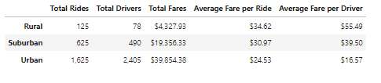
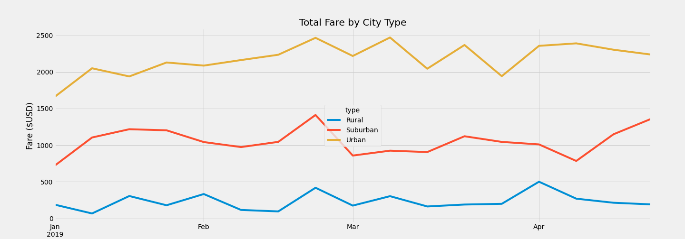

# PyBer_Analysis

## Overview of the analysis
The purpose of the PyBer project is to analyze the ride sharing data to gain insight and understanding of 5 main points; Total Rides, Total Drivers, Total Fares, 
Average Fare per Ride, and Average Fare per Driver. These metrics were gathered by breaking down types of cities where PyBer runs. Gathering the data helps to improve ride sharing in Rural, Suburban and Urban areas.

## Results

### Different City Types
This is a summary of the DataFrame in which represents the three type of areas.

* Rural areas had the least amount of rides with the highest Average Fare per Ride.
* Suburban follows 2nd in least amount of rides and second highest Average Fare per Ride.
* Urban with the highest amount of rides and least amount and least Average Fare per Ride.
According to my analysis, due to the scarcity of drivers in rural areas, the fare per ride is higher and has less overall Total Fares revenue. Though Urban areas Fare per Ride is less, the amount of drivers and rides compensates the less Fare per Ride. This generates more revenue.

## Summary

After reviewing overall analysis, I can recommend the following.
- To make the business flurish, PyBer would need to focus on getting more drivers in Rural areas. Usually rural areas are at significant distance from towns and cities that most drivers from those areas are taking longer rides and having to go back to the rural perameter.
- From a business point of view, creating incentives for Urban area drivers to head out to Rural areas would beneift the drivers and those in need of rides.
- PyBer should focus on peak days an hours to fullfill the demand of the rural areas.

